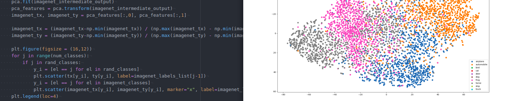
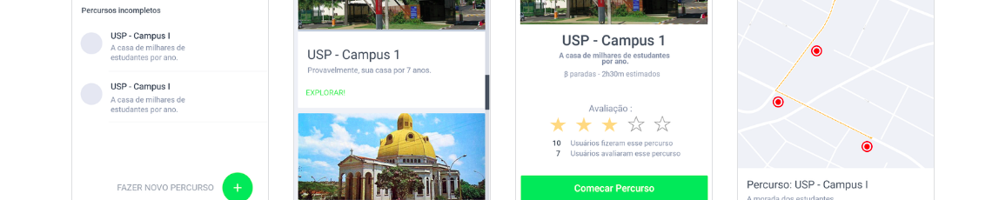

# Projects

## Unified Representations considering visual and semantic attributes in image recognition - Research project

* * *
Python (keras, matplotlib, skit-learn, numpy)
{:.faded}

[Final report (pt-br)](/assets/docs/report.pdf) `|` [Repository](https://github.com/jumc/ImageGen)

* Investigated latent space, extraction, and fusion of characteristics to create more accurate and compact representations for image classification
* Developed a deep learning method that can possibly be extended to detect adversarial examples

## `#`Descubra

* * *

Docker, React, Node.js, PostgreSQL, Marvelapp
{:.faded}

[Live prototype](https://marvelapp.com/prototype/56jhief) `|` [Repository](https://github.com/jumc/deSCubra)

* Designed and prototyped interfaces for an interactive city guide
* Worked with a team of 6 to implement it in React and Node.js, using PostgreSQL as database
* Created docker container to deploy application

## MulTItask

* * *

Unity (C#)
{:.faded}

[Play the game](https://fog-icmc.itch.io/multi-task)

* Developed minigames and core functionalities, such as uploading scores to the general scoreboard
* In this game you play as the IT Support guy in a chaotic company, where the printer is stuck, toolbars galore and dust is everywhere! Brave the caos and see how far do you last
* Official game for the [Vida de Suporte](https://vidadesuporte.com.br/) web comic
